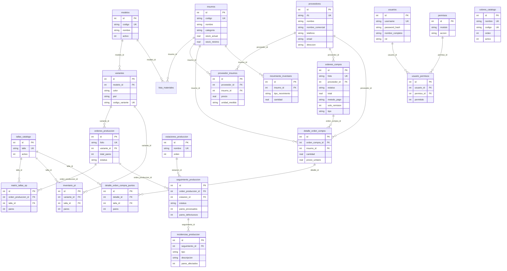
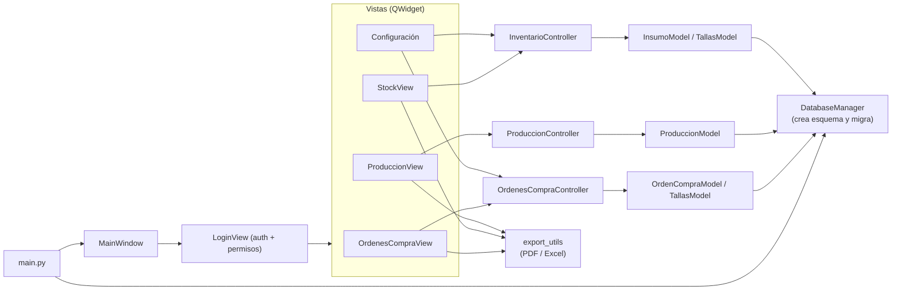

# SIAC ERP — Sistema Integral de Administración y Control

Aplicación de escritorio (Python + Qt) para la gestión de una fábrica de calzado:
**órdenes de compra**, **inventario de insumos**, **planificación de producción**,
**producto terminado** y **control de usuarios/permisos**.

- **Interfaz:** PySide6 (Qt for Python)
- **Base de datos:** SQLite (por defecto) o PostgreSQL
- **Reportes:** PDF e Excel (recibos de orden de compra, listados)
- **Desarrollado por:** Mario Felipe Luevano — © 2026

---

## Características

- **Órdenes de Compra**
  - Alta, búsqueda, cancelación y recepción de órdenes.
  - Detalle por insumo con **pares por punto (talla)** y corrida rápida desde/hasta.
  - Método de pago y modo **"Solo remisión"** (sin cálculo de IVA).
  - **Ingreso de facturas** (`tipo = factura`): el folio se captura manualmente (`FAC-...`),
    se guardan en la misma tabla y se distinguen con la columna **Tipo** y color de fila
    **verde claro** (`#daf2d0`); las órdenes de compra **recibidas** también se resaltan igual.
  - Impresión **PDF** y exportación **Excel** en formato recibo (cabecera, "Vendido a:",
    columnas `#punto`, TOTAL PARES, IVA 16%, TOTAL, información de pago).
  - Catálogo de proveedores con **nombre comercial**, productos y precios (`proveedor_insumos`).
- **Inventario**
  - Insumos con stock y stock mínimo, movimientos de entrada/salida/ajuste.
  - Importación masiva de proveedores e insumos desde `DIRECTORIO.xlsx`
    (el alias del proveedor se guarda como nombre comercial).
- **Tablas estilo Excel:** en todas las tablas del sistema puede ajustar el **ancho de columnas**
  y el **alto de filas** arrastrando el borde de la cabecera, o con **doble clic** para el ajuste
  automático al contenido.
- **Sandbox y componentes propios:** área de pruebas de controles (solo admin) y stack de
  componentes **reutilizables** en `src/components/` con catálogo (`listar_componentes()`).
- **Producción**
  - Modelos, variantes (color/piel), lista de materiales (BOM).
  - Órdenes de producción con matriz de tallas, kanban por estaciones,
    seguimiento e incidencias.
  - Producto terminado (inventario `PT`) con variante × talla.
- **Configuración**
  - Unidades de medida, áreas de producción, **puntos** y **colores** de variante.
  - **Generación en serie de puntos** (desde/hasta + Generar), activar/desactivar/vaciar.
  - Usuarios y permisos (ACL por módulo y acción).
- **Seguridad:** inicio de sesión obligatorio y permisos por módulo
  (`ver`, `crear`, `editar`, `eliminar`, `exportar`).

---

## Requisitos

| Requisito | Versión |
|---|---|
| Windows | 10 / 11 (64 bits) |
| Python | 3.11+ |
| Pip | incluido con Python |
| Git | 2.x (opcional, para clonar) |

> Para PostgreSQL (opcional): servidor 14+ y credenciales con permisos de `CREATE TABLE`.

---

## Diagrama de Base de Datos (ERD)



### Flujo de la aplicación



---

## Puesta en operación

### 1. Clonar el repositorio

```powershell
git clone https://github.com/gorettiboots-commits/siacerp.git
cd siacerp
```

### 2. Crear el entorno virtual e instalar dependencias

```powershell
py -3.11 -m venv .venv
.\.venv\Scripts\Activate.ps1
pip install --upgrade pip
pip install -r requirements.txt
```

Dependencias instaladas: `PySide6`, `bcrypt`, `psycopg2-binary`, `openpyxl`, `Pillow`, `reportlab`.

### 3. Configurar la base de datos

`config.ini` no se sube al repositorio (puede contener credenciales).
Cree la configuración local a partir de la plantilla:

```powershell
copy config.example.ini config.ini
```

Y edite `config.ini` en la raíz del proyecto:

```ini
[database]
; Modo de base de datos: sqlite o postgresql
engine = sqlite

; Configuración SQLite
sqlite_path = goretti_erp.db

; Configuración PostgreSQL (solo si engine = postgresql)
pg_host = localhost
pg_port = 5432
pg_user = postgres
pg_password = postgres
pg_database = goretti_erp

[app]
company_name = SIAC
app_title = SIAC ERP
version = 1.0.0
```

- **SQLite (recomendado para inicio):** el archivo `goretti_erp.db` se crea automáticamente
  en la primera ejecución junto con el esquema y los datos iniciales.
- **PostgreSQL:** cree la base vacía (`CREATE DATABASE goretti_erp;`) y cambie `engine = postgresql`.
  El esquema se crea automáticamente al arrancar.

> ⚠️ **Sin contraseña embebida:** en producción use un usuario de PostgreSQL dedicado
> y evite subir `config.ini` con credenciales al repositorio.

### 4. Primer arranque

```powershell
python main.py
```

Al iniciar, `DatabaseManager.initialize_schema()` ejecuta el esquema y las **migraciones
automáticas** (agrega columnas/tablas nuevas sin borrar datos).

**Acceso inicial:**

| Usuario | Contraseña | Rol |
|---|---|---|
| `admin` | `admin123` | admin |

> Cambie la contraseña y ajuste los permisos desde **Archivo → Configuración → Usuarios y Accesos**.

### 5. Acceso rápido (opcional)

El archivo `run.bat` lanza la aplicación con `pythonw` sin consola.
Ajuste la ruta de Python dentro del archivo si no usa `C:\Users\<usuario>\AppData\Local\Programs\Python\Python311`.

---

## Configuración inicial del sistema

Antes de operar, revise **Archivo → Configuración**:

1. **Unidades de Medida** — verificar el catálogo base (Pieza, dm², Metro, Kilogramo, etc.).
2. **Áreas de Producción** — estaciones del taller (Corte, Pespunte, Montado, Ensuelado,
   Acabado, Empaque).
3. **Puntos de Variante** — use **"Generar puntos en serie"** con los selectores
   *Desde/Hasta* + **Generar** para crear el catálogo sin capturar uno a uno.
   También puede activar, desactivar o **vaciar** la lista.
4. **Colores de Variante** — catálogo de colores.
5. **Usuarios y Accesos** — crear usuarios y asignar permisos por módulo/acción.

---

## Importación de proveedores e insumos (Excel)

El script `scripts/importar_directorio.py` carga el catálogo desde `DIRECTORIO.xlsx`
colocado en la raíz del proyecto:

- **Hoja `DIRECTOS`** → proveedores (nombre, **alias → nombre comercial**, razón social,
  teléfono, email, dirección).
- **Hoja `MATERIALES `** → materiales por proveedor (material, unidad, precio, comentario).

El proceso es **idempotente** (no duplica proveedores/insumos; actualiza lo que falte).

```powershell
python scripts/importar_directorio.py
```

---

## Operación por módulos

### Órdenes de Compra
1. **+ Nueva Orden** → folio automático (`OC-0001`), proveedor, método de pago,
   y **"Solo remisión (sin impuestos)"** si aplica.
2. Agregar insumos; por cada uno, **Configurar Tallas** para capturar **pares por punto**
   (con corrida rápida *De punto → A punto → pares por punto*).
3. Guardar. Con la orden seleccionada: **Ver Detalle**, **Imprimir PDF** o **Exportar Excel**
   (formato recibo, orientación horizontal automática si hay más de 6 columnas de puntos).
4. **Ingresar Factura** → captura el **folio manualmente** (ej. `FAC-0001`); la factura se
   guarda como un documento más en la tabla (tipo *Factura*, resaltada en verde claro).
   No se recibe en inventario.
5. **Recibir Orden** actualiza el stock de insumos y registra movimientos.
6. Las órdenes pendientes se pueden **Cancelar**.
7. La columna **Tipo** identifica cada documento; las filas con orden **recibida** o tipo
   **factura** se muestran en color `#daf2d0`.

### Inventario
- **Insumos**: alta con código, categoría y unidad de medida; stock y stock mínimo.
- **Movimientos**: entrada, salida o ajuste; se registran con referencia a la orden que los origina.

### Producción
1. **Catálogos** → Modelos → Variantes (color/piel) → **Lista de Materiales** (BOM).
2. **Órdenes de Producción** → folio automático (`OP-0001`), variante y **matriz de tallas**
   (pares por talla). El total de pares se calcula solo.
3. **Kanban** → arrastrar la orden entre estaciones; registrar pares procesados/defectuosos
   e incidencias.
4. Al terminar, **Producto Terminado** registra el inventario `PT` por variante × talla.

### Reportes
- Recibos de OC en PDF y Excel (con o sin IVA según *solo remisión*).
- Exportación de listados (órdenes, proveedores, inventario) a Excel.

---

## Componentes propios del sistema

Los controles se prototipan primero en el **Sandbox** (`src/views/sandbox_view.py`,
visible solo para el rol `admin`). Cuando un control se **aprueba**, se desarrolla de
forma **reutilizable** en `src/components/` y se registra en el catálogo. El sandbox deja
de ser el dueño del código y pasa a ser una demo que usa el componente aprobado.

### Catálogo (`src/components/__init__.py`)

| Función | Descripción |
|---|---|
| `registrar_componente(nombre, clase, descripcion)` | Registra un componente reutilizable en el catálogo |
| `listar_componentes()` | Lista los componentes disponibles (nombre + descripción) |
| `obtener_componente(nombre)` | Devuelve la clase registrada o lanza `KeyError` |

### Componentes disponibles

| Nombre | Descripción |
|---|---|
| `odoo_list` | Vista de listado con alternador tabla/lista/iconos (tarjetas), columnas ordenables y selección/doble clic configurable |
| `matriz_tallas` | Matriz de tallas por bloques: encabezado negro/texto blanco, filas de captura, navegación Enter/Tab y celdas sin flechas numéricas |
| `complexGrid` | Tabla de datos con búsqueda, filtros, agrupación, vistas lista/iconos/tabla, acciones por registro y exportación Excel/PDF/Imprimir |

### Ejemplo de uso

```python
from src.components import obtener_componente

MatrizTallas = obtener_componente("matriz_tallas")
dlg = MatrizTallas(puntos)           # puntos: list[dict] con "id" y "punto"
if dlg.exec():
    valores = dlg.obtener_valores()  # -> {"15": 42, "15.5": 0, ...}
```

El componente `matriz_tallas` expone cada elemento de texto como **propiedad** para
referenciarlo con precisión en el código:

- `dlg.encabezado_general` — `QLabel` con el encabezado general (por defecto `TALLAS`).
- `dlg.encabezados["15"]` — `QLabel` del encabezado del punto.
- `dlg.celdas["15"]` — celda de captura del punto.
- `dlg.obtener_valores()` / `dlg.establecer_valores({...})` — leer o precargar valores.

### `complexGrid`

Tabla de datos con búsqueda, filtros, agrupación, vistas **lista/iconos/tabla**,
acciones por registro y exportación **Excel/PDF/Imprimir**.

```python
from src.components import obtener_componente

ComplexGrid = obtener_componente("complexGrid")

grid = ComplexGrid()
grid.set_columnas([
    {"key": "codigo", "titulo": "Código", "ancho": 100},
    {"key": "nombre", "titulo": "Insumo", "ancho": 240},
    {"key": "stock_actual", "titulo": "Stock", "ancho": 90, "tipo": "numero"},
])
grid.set_renderers(
    fila=lambda r: [r["codigo"], r["nombre"], r["stock_actual"]],
    tarjeta=lambda r: {"icono": "inventario", "titulo": r["nombre"],
                       "subtitulo": r["codigo"], "badge": str(r["stock_actual"])},
)
grid.set_acciones([
    {"texto": "Ver", "icono": "ver", "color": "#4f46e5", "callback": ver},
    {"texto": "Eliminar", "icono": "eliminar", "color": "#dc2626", "callback": eliminar},
])
grid.set_agrupacion("categoria")      # o None para desagrupar
grid.set_filtros([lambda r: r["stock_actual"] > 0])
grid.set_reporte_config({"titulo": "Reporte", "subtitulo": "..."})
grid.set_datos(registros)             # list[dict]
```

Métodos/atributos principales:

- `set_columnas([{key, titulo, ancho, tipo}])` — define columnas; `tipo: "numero"`
  alinea a la derecha.
- `set_renderers(fila, claves, tarjeta, lista)` — funciones de render por vista.
- `set_acciones([{texto, icono, color, callback}])` — botones por registro (la fila
  duplica su alto para mostrarlos).
- `set_filtros([fn(rec) -> bool])`, `set_agrupacion(clave | None)`.
- `set_plantilla_excel(ruta, inicio="A3")` — exportar sobre una plantilla `.xlsx`.
- `set_reporte_config({titulo, subtitulo})` — encabezado para exportar/imprimir.
- `buscar(texto)` / `set_buscador_visible(bool)`.
- `datos_visibles()`, `registro_seleccionado()`, `table` (`QTableWidget`).
- Señales: `doubleClicked`, `selectionChanged`.

---

## Respaldo y restauración

**SQLite**
1. Cierre la aplicación (con WAL, copiar en caliente puede dejar archivos `-wal` pendientes).
2. Copie `goretti_erp.db` (junto con `goretti_erp.db-wal` y `-shm` si existen y la app está abierta).

```powershell
copy goretti_erp.db backup_goretti_%date%_%time:~0,2%%time:~3,2%.db
```

**PostgreSQL**

```powershell
pg_dump -U postgres -h localhost goretti_erp > goretti_erp_backup.sql
psql -U postgres -h localhost -d goretti_erp -f goretti_erp_backup.sql
```

> Sugerencia: programe una tarea de Windows (Task Scheduler) que copie el archivo
> SQLite diariamente antes de abrir la aplicación.

---

## Estructura del proyecto

```
siacerp/
├── main.py                     # Punto de entrada
├── run.bat                     # Lanzador sin consola
├── config.example.ini          # Plantilla de configuración (copiar a config.ini)
├── config.ini                  # Configuración local (NO se sube al repositorio)
├── requirements.txt            # Dependencias
├── DIRECTORIO.xlsx             # Plantilla de importación (proveedores/materiales)
├── scripts/
│   └── importar_directorio.py  # Importación masiva desde Excel
└── src/
    ├── database/
    │   ├── schema.sql          # Esquema completo (SQLite y PostgreSQL)
    │   └── db_manager.py       # Conexión, esquema y migraciones
    ├── components/             # Stack de componentes propios (catálogo)
    │   ├── __init__.py         # registro, listar_componentes(), obtener_componente()
    │   ├── tallas_matrix.py    # MatrizTallasDialog (aprobado desde Sandbox)
    │   └── complex_grid.py     # ComplexGrid (aprobado desde Sandbox)
    ├── models/                 # Acceso a datos (ORM ligero, capa SQL)
    ├── controllers/            # Lógica de negocio
    ├── views/                  # Vistas Qt y diálogos (incluye sandbox_view.py)
    │   └── assets/logo.png
    └── utils/
        ├── export_utils.py     # PDF / Excel (recibos y listados)
        ├── folios.py           # Folios secuenciales OC-/OP-
        ├── table_utils.py      # Tablas estilo Excel (ancho/alto por arrastre o doble clic)
        ├── ui_helpers.py       # Carga de estilos QSS
        └── styles.qss
```

---

## Solución de problemas

| Problema | Causa probable | Solución |
|---|---|---|
| `Base de datos en uso` / no responde | La app corre en segundo plano (`pythonw.exe`) con la BD abierta | Cierre el proceso desde el Administrador de tareas y reintente |
| No aparecen columnas nuevas (pago/remisión) | La app no se ha reiniciado tras la migración | Cierre y abra de nuevo; `initialize_schema()` migra automáticamente |
| `ModuleNotFoundError: PySide6` | No se instalaron dependencias | `.\.venv\Scripts\Activate.ps1` y `pip install -r requirements.txt` |
| Error al importar `DIRECTORIO.xlsx` | Hojas con nombres distintos o archivo ausente | Use las hojas `DIRECTOS` y `MATERIALES ` (con espacio al final) |
| Login rechazado | Usuario/contraseña incorrectos o usuario inactivo | Use `admin / admin123` o cree un usuario con permisos |
| Impresión/Excel lento | Logo PNG muy pesado embebido en base64 | Reduzca `src/views/assets/logo.png` (<= 64×64 px) |

---

## Licencia

Software propietario — **no es open source**.

- **Desarrollo:** Mario Felipe Luevano.
- **Derechos de uso y modificación:** Francisco Aguirre (titular del repositorio).

Todos los derechos reservados — © 2026.
