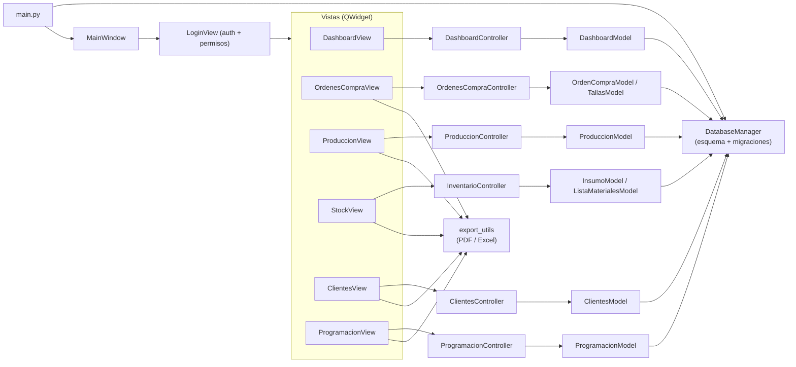
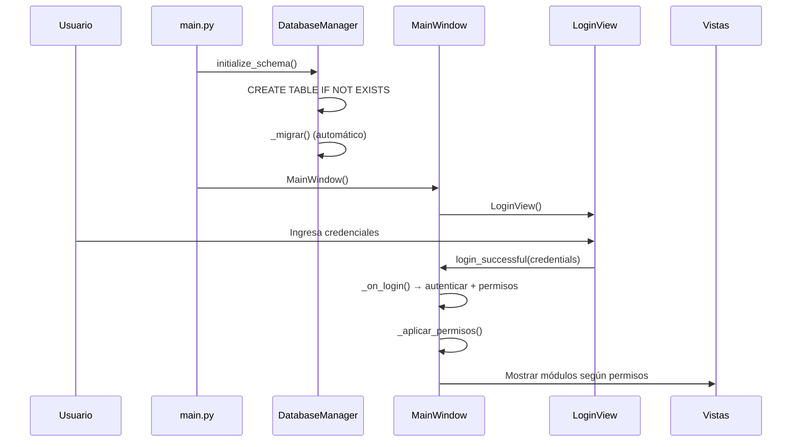
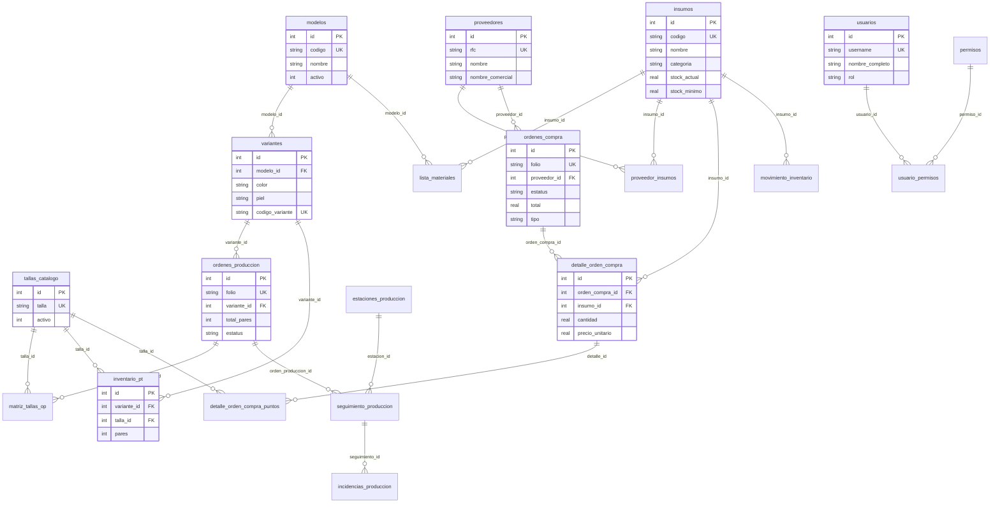

# SIAC ERP — Sistema Integral de Administración y Control

> **Plataforma de gestión integral para fábricas de calzado**
> Control completo de órdenes de compra, inventario de insumos, planificación de producción, producto terminado, clientes y permisos de usuario.


---

## 📋 Índice

- [Descripción](#descripción)
- [Características principales](#características-principales)
- [Módulos del sistema](#módulos-del-sistema)
- [Arquitectura técnica](#arquitectura-técnica)
- [Requisitos del sistema](#requisitos-del-sistema)
- [Instalación y configuración](#instalación-y-configuración)
- [Primer arranque](#primer-arranque)
- [Diagrama de base de datos](#diagrama-de-base-de-datos)
- [Componentes reutilizables](#componentes-reutilizables)
- [Sistema de reportes](#sistema-de-reportes)
- [Integración móvil y Supabase](#integración-móvil-y-supabase)
- [Arquitectura multi-tenant](#arquitectura-multi-tenant)
- [Distribución y empaquetado](#distribución-y-empaquetado)
- [Importación de proveedores](#importación-de-proveedores-e-insumos)
- [Respaldo y restauración](#respaldo-y-restauración)
- [Solución de problemas](#solución-de-problemas)
- [Historial de cambios](#historial-de-cambios)
- [Documentación](#documentación)
- [Desarrolladores](#desarrolladores)
- [Licencia](#licencia)

---

## Descripción

**SIAC ERP** es una aplicación de escritorio desarrollada en **Python + Qt** diseñada específicamente para la gestión integral de una fábrica de calzado. El sistema cubre el ciclo completo desde la compra de materia prima hasta el producto terminado, incluyendo:

- Gestión de proveedores y órdenes de compra con distribución por puntos/tallas
- Control de inventario con movimientos de entrada/salida/ajuste y kardex
- Planificación y seguimiento de producción con tablero Kanban
- Fichas técnicas con especificaciones de diseño, control de materiales y costos
- Programación semanal de producción con distribución por corridas
- Gestión de clientes y pedidos con captura por tallas
- Dashboard con indicadores clave de negocio y gráficas
- Sistema de etiquetas (editor visual + impresión desde app móvil vía Supabase)
- Impresora virtual para simulación en pantalla
- Sistema de permisos por módulo y acción
- Reportes en PDF y Excel con diseño profesional y membrete de empresa

**Desarrollado por:** Mario Felipe Luevano — © 2026
**Derechos de uso:** Francisco Aguirre (titular del repositorio)

---

## Características principales

| Característica | Descripción |
|---|---|
| **Interfaz gráfica** | PySide6 (Qt for Python ≥ 6.5) con tema personalizado mint/salvia |
| **Base de datos** | SQLite (desarrollo) o PostgreSQL 14+ (producción) — compatibilidad dual |
| **Reportes** | PDF y Excel con diseño profesional y membrete de empresa |
| **Seguridad** | Contraseñas con bcrypt, login obligatorio, permisos ACL por módulo |
| **Idioma** | Español completo en código, interfaz y base de datos |
| **Navegación** | Toolbar superior con iconos, atajos de teclado Ctrl+N |
| **Tabs estilo Excel** | Ajuste de columnas por arrastre o doble clic |
| **Componentes propios** | Stack reutilizable aprobado desde Sandbox |

---

## Módulos del sistema

### 📊 Dashboard
Pantalla de resumen con indicadores clave (KPI):
- Órdenes de compra pendientes y importe del mes
- Órdenes de producción en curso
- Insumos con stock bajo
- Pares en producto terminado
- Movimientos de inventario del día
- Gráfica de barras de compras por mes
- Navegación directa a módulos desde tarjetas KPI

### 🛒 Órdenes de Compra
- Alta, búsqueda, cancelación y recepción de órdenes
- Detalle por insumo con **pares por punto (talla)** y corrida rápida
- Método de pago y modo **"Solo remisión"** (sin IVA)
- **Ingreso de facturas**: folio manual (`FAC-...`), color verde claro `#daf2d0`
- Impresión PDF y exportación Excel en formato recibo
- Catálogo de proveedores con nombre comercial, productos y precios

### 🏭 Producción
- **Catálogos**: Modelos → Variantes (color/piel) → Lista de Materiales (BOM)
- **Órdenes de Producción**: folio automático `OP-0001`, matriz de tallas
- **Tablero Kanban**: arrastrar órdenes entre estaciones del taller
- **Seguimiento**: pares procesados, defectuosos e incidencias por estación
- **Producto Terminado**: inventario por variante × talla
- **Ficha Técnica**: diseño profesional con materiales, costos y fotos

### 📦 Inventario
- Insumos con stock actual, stock mínimo y categoría
- Movimientos de entrada, salida y ajuste con referencia
- Tabla de conflictos (insumos con stock bajo)
- Importación masiva de proveedores e insumos desde Excel

### 👥 Clientes y Pedidos
- Catálogo de clientes con datos de contacto
- Pedidos de cliente con distribución por tallas
- Folios secuenciales `PED-0001`
- Impresión y exportación de pedidos

### 📅 Programación Semanal
- Organización de pedidos por semana de producción
- Líneas de programación con cliente, modelo, piel, color y fecha
- Distribución por tallas con totales
- Exportación e impresión con diseño profesional

### ⚙️ Configuración
- Unidades de medida, áreas de producción
- Catálogo de tallas/puntos con generación en serie
- Colores de variante
- Usuarios y permisos ACL por módulo/acción
- Datos de empresa (logo, nombre, RFC, dirección)
- Cola de impresión de etiquetas

### 🏷️ Sistema de Etiquetas
- **Editor visual** de etiquetas con diseño drag & drop
- Modos de impresión: **Flejes** (cajas) y **Partidas** (con matriz de tallas)
- Integración con **app móvil** (React Native) vía Supabase
- **Cola de impresión:** Solicitudes del móvil → impresión en escritorio
- **Histórico** de impresiones con opción de reimpresión
- Impresión directa a etiquetadora térmica

### 🖨️ Impresora Virtual
- Simulación de impresión en pantalla sin impresora física
- Configurable desde **Archivo → Configuración → Impresión**
- Útil para revisar documentos antes de imprimir

### 🧪 Sandbox
- Área de pruebas de controles (solo rol `admin`)
- Catálogo de componentes aprobados
- Editor de etiquetas con diseño visual
- Previsualización de impresión

---

## Arquitectura técnica

### Patrón MVC por capas

```
┌─────────────────────────────────────────────────────┐
│                    VISTAS (views/)                   │
│  QMainWindow, QWidget, QDialog, QStackedWidget      │
│  → Construyen la interfaz gráfica                    │
│  → NUNCA tocan la base de datos directamente         │
├─────────────────────────────────────────────────────┤
│                CONTROLLERS (controllers/)             │
│  OrdenesCompraController, ProduccionController...    │
│  → Contienen lógica de negocio                       │
│  → NO importan Qt                                    │
│  → Delegan en modelos para acceso a datos            │
├─────────────────────────────────────────────────────┤
│                   MODELOS (models/)                   │
│  OrdenCompraModel, InsumoModel, TallasModel...       │
│  → Solo hacen SQL                                    │
│  → NO contienen lógica de negocio ni de UI           │
│  → NO llaman a otros modelos                         │
├─────────────────────────────────────────────────────┤
│             BASE DE DATOS (database/)                 │
│  DatabaseManager (singleton) → SQLite o PostgreSQL   │
│  schema.sql → Esquema completo                       │
│  Migraciones automáticas en cada arranque            │
└─────────────────────────────────────────────────────┘
```

### Flujo de la aplicación



### Flujo de arranque



---

## Requisitos del sistema

| Requisito | Versión mínima | Notas |
|---|---|---|
| **Windows** | 10 / 11 (64 bits) | Sistema operativo requerido |
| **Python** | 3.11+ | Recomendado: 3.11 o 3.12 |
| **Pip** | Incluido con Python | Para instalar dependencias |
| **Git** | 2.x | Opcional, para clonar el repositorio |

### Para PostgreSQL (opcional — producción)

| Requisito | Versión |
|---|---|
| **PostgreSQL** | 14+ |
| **Credenciales** | Usuario con permisos `CREATE TABLE` |

### Dependencias de producción

| Paquete | Versión | Uso |
|---|---|---|
| `PySide6` | ≥ 6.5.0 | Interfaz gráfica Qt |
| `bcrypt` | ≥ 4.0.0 | Hashing de contraseñas |
| `psycopg2-binary` | ≥ 2.9.0 | Conector PostgreSQL |
| `openpyxl` | ≥ 3.1.0 | Exportación a Excel |
| `Pillow` | ≥ 10.0.0 | Procesamiento de imágenes |
| `reportlab` | ≥ 4.0.0 | Generación de PDF |

### Dependencias de desarrollo

| Paquete | Versión | Uso |
|---|---|---|
| `pytest` | ≥ 8.0 | Pruebas unitarias |
| `pyinstaller` | ≥ 6.0 | Empaquetado para distribución |

### Arquitectura de datos

```
┌─────────────────────────────────────────────────────────────┐
│                    APLICACIÓN (Python + Qt)                  │
├─────────────────────────────────────────────────────────────┤
│  Escritorio (PySide6)  ←→  Supabase  ←→  App Móvil (RN)   │
├─────────────────────────────────────────────────────────────┤
│              Base de Datos Local                             │
│  ┌─────────────┐  ┌──────────────┐  ┌──────────────────┐  │
│  │   SQLite     │  │  PostgreSQL  │  │  Archivos locales │  │
│  │ (desarrollo) │  │ (producción) │  │  (logs, backups)  │  │
│  └─────────────┘  └──────────────┘  └──────────────────┘  │
└─────────────────────────────────────────────────────────────┘
```

### Sincronización de datos

| Escenario | Estado |
|---|---|
| Escritorio ↔ Escritorio (misma BD) | ✅ Funcional (SQLite o PostgreSQL) |
| Escritorio ↔ Escritorio (multi-tenant) | ✅ Funcional (vía Supabase, sync cada 5 min) |
| Móvil → Escritorio (cola de impresión) | ✅ Funcional (vía Supabase) |
| Escritorio ↔ Móvil (datos completos) | ✅ Funcional (Supabase + empresa_id) |
| Multi-tenant (aislamiento por empresa) | ✅ Funcional (RLS por empresa_id) |

---

## Instalación y configuración

### 1. Clonar el repositorio

```bash
git clone https://github.com/gorettiboots-commits/siacerp.git
cd siacerp
```

### 2. Crear entorno virtual e instalar dependencias

```bash
# Crear entorno virtual
py -3.11 -m venv .venv

# Activar entorno (Windows)
.\.venv\Scripts\Activate.ps1

# Linux/macOS
source .venv/bin/activate

# Instalar dependencias
pip install --upgrade pip
pip install -r requirements.txt
```

### 3. Configurar la base de datos

```bash
# Copiar plantilla de configuración
copy config.example.ini config.ini
```

Editar `config.ini` según el motor de base de datos:

**SQLite (recomendado para desarrollo):**

```ini
[database]
engine = sqlite
sqlite_path = goretti_erp.db
```

**PostgreSQL (producción):**

```ini
[database]
engine = postgresql
pg_host = localhost
pg_port = 5432
pg_user = postgres
pg_password = SU_CONTRASEÑA
pg_database = goretti_erp
```

> ⚠️ **Seguridad:** `config.ini` contiene credenciales y **NO se sube al repositorio**.
> Para PostgreSQL, crear primero la base vacía: `CREATE DATABASE goretti_erp;`

### 4. Configuración de empresa (opcional)

Editar la sección `[app]` en `config.ini`:

```ini
[app]
company_name = SIAC
app_title = SIAC ERP
version = 1.0.0
```

Los datos de empresa (logo, RFC, dirección) se configuran desde **Archivo → Configuración** dentro de la aplicación.

---

## Primer arranque

```bash
python main.py
```

Al iniciar:
1. `DatabaseManager.initialize_schema()` crea todas las tablas con `CREATE TABLE IF NOT EXISTS`
2. Se ejecutan las migraciones automáticas (agrega columnas/tablas nuevas sin borrar datos)
3. Se muestra la pantalla de login

### Credenciales iniciales

| Usuario | Contraseña | Rol |
|---|---|---|
| `admin` | `admin123` | admin |

> 🔐 **IMPORTANTE:** Cambiar la contraseña inmediatamente después del primer ingreso.
> Ir a **Archivo → Configuración → Usuarios y Accesos**.

### Acceso rápido (opcional)

El archivo `run.bat` lanza la aplicación con `pythonw` sin ventana de consola.
Ajustar la ruta de Python dentro del archivo si es necesario.

---

## Diagrama de base de datos



---

## Componentes reutilizables

El sistema incluye un stack de componentes propios aprobados desde el Sandbox.
Cada componente tiene su prueba `pytest` y está registrado en el catálogo.

### Catálogo de componentes

| Componente | Descripción |
|---|---|
| `odoo_list` | Vista de listado con alternador tabla/lista/iconos, columnas ordenables y selección configurable |
| `matriz_tallas` | Matriz de tallas por bloques con navegación Enter/Tab |
| `matriz_tallas_widget` | Control embebido de matriz de tallas (sin diálogo) |
| `complexGrid` | Tabla de datos con búsqueda, filtros, agrupación, vistas y exportación |
| `grid_hibrido` | Wrapper de ComplexGrid con toolbar de 2 filas y barra de estado |
| `preview_impresion` | Vista previa WYSIWYG con zoom, orientación e impresión a PDF |
| `date_picker` | Selector de fecha con calendario emergente (formato dd/MM/yyyy) |
| `campo_historico` | Campo de texto con histórico de capturas y autocompletado |
| `notificacion_flotante` | Toasts animados con tipos info/success/warning/error |
| `label_canvas` | Lienzo interactivo de diseño de etiqueta con drag & drop |
| `editor_etiqueta` | Creador/editor de etiquetas con guardado en BD |
| `matriz_preview` | Widget flotante de vista previa de matriz al hacer hover |

### Uso de componentes

```python
from src.components import obtener_componente

# Matriz de tallas
MatrizTallas = obtener_componente("matriz_tallas")
dlg = MatrizTallas(puntos)
if dlg.exec():
    valores = dlg.obtener_valores()

# Grid de datos
ComplexGrid = obtener_componente("complexGrid")
grid = ComplexGrid()
grid.set_columnas([...])
grid.set_datos(registros)

# Vista previa de impresión
from src.components.preview_impresion import previsualizar_html
previsualizar_html(html, titulo="Reporte", parent=ventana)
```

### Gestión de componentes

```python
from src.components import listar_componentes, obtener_componente

# Listar todos los componentes disponibles
componentes = listar_componentes()
for c in componentes:
    print(f"{c['nombre']}: {c['descripcion']}")

# Obtener un componente específico
MiComponente = obtener_componente("nombre_componente")
```

---

## Importación de proveedores e insumos

El script `scripts/importar_directorio.py` carga el catálogo desde `DIRECTORIO.xlsx` en la raíz del proyecto:

- **Hoja `DIRECTOS`** → Proveedores (nombre, alias → nombre comercial, razón social, teléfono, email, dirección)
- **Hoja `MATERIALES `** → Materiales por proveedor (material, unidad, precio, comentario)

El proceso es **idempotente**: no duplica proveedores/insumos, actualiza lo que falte.

```bash
python scripts/importar_directorio.py
```

---

## Respaldo y restauración

### SQLite

```bash
# Cerrar la aplicación primero
# Copiar archivos de base de datos
copy goretti_erp.db backup_goretti_%date%_%time:~0,2%%time:~3,2%.db
copy goretti_erp.db-wal backup_goretti_wal_%date%.db-wal 2>nul
```

### PostgreSQL

```bash
# Backup
pg_dump -U postgres -h localhost goretti_erp > goretti_erp_backup.sql

# Restaurar
psql -U postgres -h localhost -d goretti_erp -f goretti_erp_backup.sql
```

> 💡 **Sugerencia:** Programar una tarea de Windows (Task Scheduler) para copiar el archivo SQLite diariamente antes de abrir la aplicación.

---

## Estructura del proyecto

```
siacerp/
├── main.py                     # Único punto de entrada
├── run.bat                     # Lanzador sin consola (pythonw)
├── config.example.ini          # Plantilla de configuración
├── config.ini                  # Config local — NUNCA se sube a git
├── requirements.txt            # Dependencias de producción
├── requirements-dev.txt        # Dependencias de desarrollo
├── DIRECTORIO.xlsx             # Plantilla de importación de proveedores
├── AGENTS.md                   # Constitución del proyecto (reglas IA)
├── README.md                   # Este archivo
├── MANUAL_TECNICO.md           # Manual técnico para desarrolladores
├── MANUAL_USUARIO.md           # Manual de usuario para operadores
├── video.mp4                   # Video de bienvenida (splash)
├── default.jpg / logo.png      # Imágenes de la raíz
├── scripts/
│   ├── importar_directorio.py  # Importación masiva desde Excel
│   ├── registrar_empresa.py    # Registro de nuevas empresas
│   └── sincronizar_supabase_v5.py  # Sincronización a Supabase
├── sitio web/                  # Landing page de la marca Goretti
├── mobile/                     # App móvil (React Native)
│   ├── App.tsx                 # Entry point con React Navigation
│   ├── src/
│   │   ├── pantallas/          # Login, Inventario, OCs, Producción
│   │   ├── servicios/          # auth, inventario, ordenes, produccion
│   │   ├── tipos.ts            # Interfaces TypeScript
│   │   └── lib/supabase.ts     # Cliente Supabase
│   └── supabase/               # Esquema y migraciones Supabase
├── tests/                      # Pruebas pytest
│   ├── conftest.py             # Fixtures Qt para pruebas
│   └── test_*.py               # Pruebas por módulo/componente
└── src/
    ├── database/
    │   ├── schema.sql          # Esquema completo (SQLite y PostgreSQL)
    │   └── db_manager.py       # Conexión, esquema y migraciones
    ├── models/                 # Capa de acceso a datos (SQL)
    │   ├── orden_compra_model.py
    │   ├── inventario_model.py
    │   ├── produccion_model.py
    │   ├── clientes_model.py
    │   ├── programacion_model.py
    │   ├── dashboard_model.py
    │   ├── ficha_tecnica_model.py
    │   ├── empresa_model.py
    │   └── ...
    ├── controllers/            # Lógica de negocio
    │   ├── ordenes_compra_controller.py
    │   ├── inventario_controller.py
    │   ├── produccion_controller.py
    │   ├── clientes_controller.py
    │   ├── programacion_controller.py
    │   ├── dashboard_controller.py
    │   └── ...
    ├── views/                  # Vistas Qt y diálogos
    │   ├── main_window.py      # Ventana principal
    │   ├── login_view.py       # Pantalla de login
    │   ├── dashboard_view.py   # Dashboard del sistema
    │   ├── ordenes_compra_view.py
    │   ├── produccion_view.py
    │   ├── stock_view.py
    │   ├── clientes_view.py
    │   ├── programacion_view.py
    │   ├── configuracion_view.py
    │   ├── sandbox_view.py
    │   ├── dialogs.py          # Todos los diálogos
    │   ├── kanban_view.py
    │   └── assets/
    │       └── logo.png
    ├── components/             # Componentes aprobados (catálogo)
    │   ├── __init__.py         # registro, listar, obtener
    │   ├── complex_grid.py
    │   ├── tallas_matrix.py
    │   ├── preview_impresion.py
    │   ├── date_picker.py
    │   ├── campo_historico.py
    │   ├── notificacion_flotante.py
    │   ├── editor_etiqueta.py
    │   ├── grid_hibrido.py
    │   └── matriz_preview.py
    └── utils/                  # Helpers y utilidades
        ├── export_utils.py     # PDF / Excel
        ├── folios.py           # Folios secuenciales
        ├── table_utils.py      # Tablas estilo Excel
        ├── ui_helpers.py       # Helpers de UI
        ├── icons.py            # Iconos SVG embebidos
        ├── security.py         # Bcrypt / contraseñas
        ├── print_template.py   # Plantilla base de impresión
        ├── ficha_tecnica_print.py
        ├── kardex_print.py
        ├── programacion_print.py
        ├── logs.py             # Logging del sistema
        ├── respaldo_bd_utils.py
        ├── supabase_service.py # Conexion a Supabase (multi-tenant)
        ├── sync_service.py     # Sincronizacion local <-> Supabase
        └── styles.qss          # Estilos globales QSS
```

---

## Sistema de reportes

### Tipos de reporte

| Reporte | Módulo | Formato | Descripción |
|---|---|---|---|
| Recibo de OC | Órdenes de Compra | PDF / Excel | Formato recibo con tallas, IVA e información de pago |
| Ficha Técnica | Producción | PDF | Hoja de especificación de diseño con materiales y costos |
| Kardex de Insumo | Inventario | PDF | Historial de movimientos con saldo acumulado |
| Pedido de Cliente | Clientes | PDF / Excel | Pedido con distribución por tallas |
| Programación | Programación | PDF / Excel | Reporte semanal con corridas y subtotales |
| Listados | Cualquier módulo | Excel | Exportación de tablas de datos |

### Plantilla de impresión

Todos los reportes usan la plantilla compartida `src/utils/print_template.py` con:
- **Identidad visual** mint/salvia (colores corporativos)
- **Membrete** con logo y nombre de la empresa
- **Folio y fecha** del documento
- **Tabla de datos** con formato profesional
- **Pie de página** con mensaje de agradecimiento
- **Vista previa WYSIWYG** antes de imprimir

---

## Integración móvil y Supabase

### App móvil (React Native)

El sistema incluye una aplicación móvil complementaria desarrollada en **React Native** que permite:
- Captura de pedidos de cliente desde el campo
- Solicitud de impresión de etiquetas
- Consulta de inventario
- Visualización de órdenes de compra y producción
- Cambio de estatus de producción (Kanban)

La app móvil se conecta al sistema a través de **Supabase** (Backend as a Service).

### Cola de impresión

El flujo de impresión desde el móvil funciona así:

```
App Móvil → Supabase (impresiones_etiqueta) → SIAC ERP (Cola de Impresión) → Impresora
```

1. El móvil inserta solicitudes en la tabla `impresiones_etiqueta` con estatus `pendiente`
2. El escritorio consulta las solicitudes pendientes desde **Archivo → Cola de Impresión**
3. Se imprime la etiqueta y se marca como `impresa` en Supabase
4. La solicitud queda en el histórico local para reimpresión

### Configuración de Supabase

```ini
# En config.ini (NO se sube a git)
[supabase]
url = https://tu-proyecto.supabase.co
anon_key = tu-anon-key-aqui
service_role_key = tu-service-role-key
empresa_id = uuid-de-tu-empresa
```

---

## Arquitectura multi-tenant

**SIAC ERP** soporta múltiples empresas (tenants) en una sola instancia de Supabase, con aislamiento total de datos. Cada empresa tiene sus propios usuarios, inventario, órdenes de compra y producción.

### Concepto

```
┌─────────────────────────────────────────────────────────────┐
│                    SUPABASE (multi-tenant)                   │
├─────────────────────────────────────────────────────────────┤
│                                                              │
│  ┌──────────────┐  ┌──────────────┐  ┌──────────────┐     │
│  │  SIAC ERP     │  │  Calzado     │  │  Calzado     │     │
│  │  (empresa A)  │  │  Durán (B)   │  │  Rivera (C)  │     │
│  │               │  │              │  │              │     │
│  │ 24 insumos    │  │ 0 insumos    │  │ 0 insumos    │     │
│  │ 1 OC          │  │ 0 OCs        │  │ 0 OCs        │     │
│  │ 3 OPs         │  │ 0 OPs        │  │ 0 OPs        │     │
│  └──────────────┘  └──────────────┘  └──────────────┘     │
│        │                  │                  │              │
│        └──────────────────┴──────────────────┘              │
│              RLS filtra por empresa_id                       │
└─────────────────────────────────────────────────────────────┘
```

### Flujo de datos

```
┌─────────────────────────────────────────────────────────────┐
│  TERMINAL 1 (escritorio - SIAC ERP)                         │
│  BD local SQLite + empresa_id                               │
│  Funciona SIN internet                                      │
│  ↕ Sync cada 5 min con Supabase                             │
├─────────────────────────────────────────────────────────────┤
│                    SUPABASE                                  │
│  RLS filtra por empresa_id → aislamiento total              │
│  Auth gestiona usuarios y sesiones                          │
├─────────────────────────────────────────────────────────────┤
│  TERMINAL 2 (otra computadora - misma empresa)              │
│  BD local SQLite + Mismo empresa_id                         │
│  ↕ Sync cada 5 min → comparten datos                        │
├─────────────────────────────────────────────────────────────┤
│  APP MÓVIL (React Native)                                   │
│  Supabase directo → misma empresa                           │
│  Lee datos en tiempo real                                   │
└─────────────────────────────────────────────────────────────┘
```

### Prioridad de datos

| Nivel | Fuente de datos | Prioridad | Internet |
|---|---|---|---|
| **Escritorio** | BD local SQLite | **ALTA** (funciona offline) | No requiere |
| **Sync** | Supabase (intermedio) | MEDIA (cada 5 min) | Requiere |
| **Móvil** | Supabase directo | BAJA (solo lectura) | Requiere |

### Ventajas del diseño

- ✅ El escritorio **funciona sin internet** (BD local es la fuente de verdad)
- ✅ Múltiples terminales comparten datos vía Supabase
- ✅ La app móvil tiene acceso en tiempo real
- ✅ Cada empresa está **aislada** (RLS por empresa_id)
- ✅ El licenciamiento se valida en Supabase
- ✅ Sin costo adicional por terminal (mismo proyecto Supabase)

### Registrar una nueva empresa

```bash
python scripts/registrar_empresa.py \
    --nombre "Nombre de la Empresa" \
    --rfc "RFC000000XXX" \
    --email-admin "admin@empresa.com" \
    --password-admin "admin123"
```

El script muestra el `empresa_id` (UUID) que se debe configurar en la nueva terminal.

### Configurar una nueva terminal

1. Copiar el proyecto a la nueva computadora
2. Instalar dependencias: `pip install -r requirements.txt`
3. Editar `config.ini`:

```ini
[database]
engine = sqlite
sqlite_path = goretti_erp.db

[supabase]
url = https://tu-proyecto.supabase.co
anon_key = tu-anon-key
service_role_key = tu-service-role-key
empresa_id = UUID-DE-LA-EMPRESA
```

4. Ejecutar: `python main.py`
5. La BD local se crea automáticamente y se sincroniza con Supabase

### Tablas con empresa_id

Las siguientes tablas tienen la columna `empresa_id` para aislamiento multi-tenant:

| Tabla | Descripción |
|---|---|
| `insumos` | Materia prima |
| `modelos` | Modelos de zapato |
| `variantes` | Variantes (color/piel) |
| `proveedores` | Proveedores |
| `ordenes_compra` | Órdenes de compra |
| `detalle_orden_compra` | Detalle de OC |
| `ordenes_produccion` | Órdenes de producción |
| `seguimiento_produccion` | Avance por estación |
| `usuarios` | Usuarios del sistema |
| `clientes` | Clientes |
| `pedidos_cliente` | Pedidos de cliente |
| `programacion_semana` | Programación semanal |
| `programacion_lineas` | Líneas de programación |
| `configuracion_empresa` | Datos de empresa |
| `logs_sistema` | Logs del sistema |

### Credenciales de prueba

| Empresa | Email | Password | Rol |
|---|---|---|---|
| SIAC ERP | `admin@siac.com` | `admin123` | admin |
| SIAC ERP | `operador@siac.com` | `operador123` | operador |
| Calzado Durán | `admin@durancalzado.com` | `admin123` | admin |
| Calzado Rivera | `admin@riveracalzado.com` | `admin123` | admin |
| **Global** | `superadmin@siac.com` | `superadmin123` | **super_admin** |

### Super Admin (gestión de licencias)

El rol `super_admin` tiene acceso total a **todas las empresas** del sistema. Está diseñado para:

- **Gestionar licencias**: ver y activar/desactivar empresas
- **Supervisar el sistema**: ver estadísticas globales de todas las empresas
- **Administrar usuarios**: ver todos los usuarios de todas las empresas
- **Soporte técnico**: acceder a datos de cualquier empresa para diagnóstico

#### Dashboard de Super Admin en el escritorio

Al hacer login con `superadmin@siac.com`, aparece el botón **"Admin"** en el toolbar:

| Sección | Contenido |
|---|---|
| **KPIs globales** | Total empresas, usuarios, insumos, OCs, OPs |
| **Tabla empresas** | Nombre, RFC, estado, métricas por empresa |
| **Tabla usuarios** | Username, nombre, rol, estado, empresa |
| **Acciones** | Botón activar/desactivar por empresa |

#### Cómo funciona el aislamiento

```
Rol: super_admin (empresa_id: NULL)
  → RLS: es_super_admin(uid) retorna TRUE
  → Ve TODOS los datos de TODAS las empresas
  → Puede gestionar licencias

Rol: admin (empresa_id: UUID)
  → RLS: empresa_id = su empresa
  → Solo ve datos de SU empresa

Rol: operador (empresa_id: UUID)
  → RLS: empresa_id = su empresa
  → Solo ve datos de SU empresa
```

#### Registrar una nueva empresa

```bash
python scripts/registrar_empresa.py \
    --nombre "Nombre Empresa" \
    --rfc "RFC000000XXX" \
    --email-admin "admin@empresa.com" \
    --password-admin "admin123"
```

#### App móvil: Super Admin

El super_admin también puede hacer login en la app móvil. En el servicio de auth se incluye el helper `esSuperAdmin()` para verificar el rol.

---

## Distribución y empaquetado

### PyInstaller

El sistema se empaqueta como ejecutable standalone con PyInstaller:

```bash
# Generar ejecutable (directorio)
pyinstaller siacerp.spec

# O ejecución directa
pyinstaller --onefile --windowed --name "SIAC_ERP" main.py
```

**Ubicación de datos en producción:**
- Windows: `%APPDATA%\SIAC\` (base de datos, configuración, logs)
- Los datos se migran automáticamente al primer arranque

### Inno Setup

El instalador de Windows (`installer.iss`) genera:
- Instalación en `Program Files\SIAC ERP`
- Acceso directo en escritorio
- Desinstalador integrado
- Asociación de archivos `.siac`

```bash
# Generar instalador
build_instalador.bat
```

### Ejecución sin consola

El archivo `run.bat` lanza la aplicación con `pythonw` sin ventana de consola:
```batch
@echo off
start "" pythonw main.py
```

---

## Solución de problemas

| Problema | Causa probable | Solución |
|---|---|---|
| `Base de datos en uso` / no responde | La app corre en segundo plano (`pythonw.exe`) con la BD abierta | Cierre el proceso desde el Administrador de tareas y reintente |
| No aparecen columnas nuevas | La app no se ha reiniciado tras la migración | Cierre y abra de nuevo; `initialize_schema()` migra automáticamente |
| `ModuleNotFoundError: PySide6` | No se instalaron dependencias | Activar entorno virtual y ejecutar `pip install -r requirements.txt` |
| Error al importar `DIRECTORIO.xlsx` | Hojas con nombres distintos o archivo ausente | Usar las hojas `DIRECTOS` y `MATERIALES ` (con espacio al final) |
| Login rechazado | Usuario/contraseña incorrectos o usuario inactivo | Usar `admin / admin123` o crear un usuario con permisos |
| Impresión/Excel lento | Logo PNG muy pesado embebido en base64 | Reducir `src/views/assets/logo.png` (≤ 64×64 px) |
| Pantalla en blanco al imprimir | HTML muy grande para WebEngine (>2MB) | El sistema usa archivos temporales automáticamente |
| Cola de impresión vacía | Supabase no configurado | Verificar `config.ini` sección `[supabase]` o variables de entorno |
| Etiquetas no se imprimen | impresora virtual deshabilitada | Habilitar en Archivo → Configuración → Impresión |
| App móvil no conecta | Credenciales Supabase incorrectas | Verificar URL y anon_key en ambas plataformas |

---

## Historial de cambios

El historial completo de cambios se documenta en **[CHANGELOG.md](CHANGELOG.md)**.

Resumen de versiones:

| Versión | Fecha | Descripción |
|---|---|---|
| **[Unreleased]** | 2026-08-26 | Dashboard, ficha técnica rediseñada, costos BOM |
| **[v1.0.0]** | 2026-08-20 | Primer release oficial del sistema |

---

## Documentación

| Documento | Descripción | Audiencia |
|---|---|---|
| **[README.md](README.md)** | Este archivo — visión general del proyecto | Todos |
| **[MANUAL_TECNICO.md](MANUAL_TECNICO.md)** | Arquitectura, convenciones, guía de desarrollo | Desarrolladores |
| **[MANUAL_USUARIO.md](MANUAL_USUARIO.md)** | Guía de uso de cada módulo | Operadores / Usuarios |
| **[AGENTS.md](AGENTS.md)** | Reglas y constitución del proyecto | IAs y desarrolladores |

---

## Desarrolladores

### Convenciones de código

- **Nomenclatura:** Español en todo (identificadores, UI, mensajes, BD)
- **Archivos:** `snake_case` con sufijo de capa (`{entidad}_model.py`)
- **Clases:** `PascalCase` con sufijo de rol (`Model`, `Controller`, `View`)
- **Funciones:** `snake_case` con verbo al inicio (`listar_*`, `crear_*`)
- **Type hints:** Obligatorios en firmas públicas
- **SQL:** Placeholders (`?` en SQLite, `%s` en PostgreSQL)

### Ejecutar pruebas

```bash
# Instalar dependencias de desarrollo
pip install -r requirements-dev.txt

# Ejecutar pruebas
QT_QPA_PLATFORM=offscreen pytest

# Lint (errores bloqueantes)
flake8 . --select=E9,F63,F7,F82 --show-source
```

### CI/CD

El proyecto usa GitHub Actions (`.github/workflows/siaci.yml`):
- Ubuntu + Python 3.12
- `QT_QPA_PLATFORM=offscreen` + `LIBGL_ALWAYS_SOFTWARE=1`
- flake8 (select E9,F63,F7,F82) + pytest

### Contribuir

1. Crear rama por tarea (`feature/nombre`)
2. Desarrollar y pasar pruebas
3. Crear PR hacia `productivo1`
4. CI debe pasar sin errores
5. Revisar [AGENTS.md](AGENTS.md) para reglas del proyecto

### Recursos útiles

| Recurso | Descripción |
|---|---|
| **[CHANGELOG.md](CHANGELOG.md)** | Historial completo de cambios |
| **[AGENTS.md](AGENTS.md)** | Reglas y constitución del proyecto |
| **[MANUAL_TECNICO.md](MANUAL_TECNICO.md)** | Documentación técnica para desarrolladores |
| **[MANUAL_USUARIO.md](MANUAL_USUARIO.md)** | Guía de uso para operadores |
| **GitHub Actions** | CI/CD automatizado en cada push |

---

## Licencia

Software propietario — **no es open source**.

- **Desarrollo:** Mario Felipe Luevano
- **Derechos de uso y modificación:** Francisco Aguirre (titular del repositorio)

Todos los derechos reservados — © 2026.

---

## Métricas del proyecto

| Métrica | Valor |
|---|---|
| **Commits** | 90+ |
| **Contribuyentes** | 3 |
| **Pull Requests** | 10+ mergeados |
| **Componentes aprobados** | 11 |
| **Pruebas pytest** | 17 |
| **Archivos de código** | 60+ |
| **Primer commit** | 2026-08-04 |
| **Último commit** | 2026-08-26 |
| **Días de desarrollo** | 22 |

---

<div align="center">

**SIAC ERP** — Sistema Integral de Administración y Control

*Gestión integral para fábricas de calzado*


</div>
